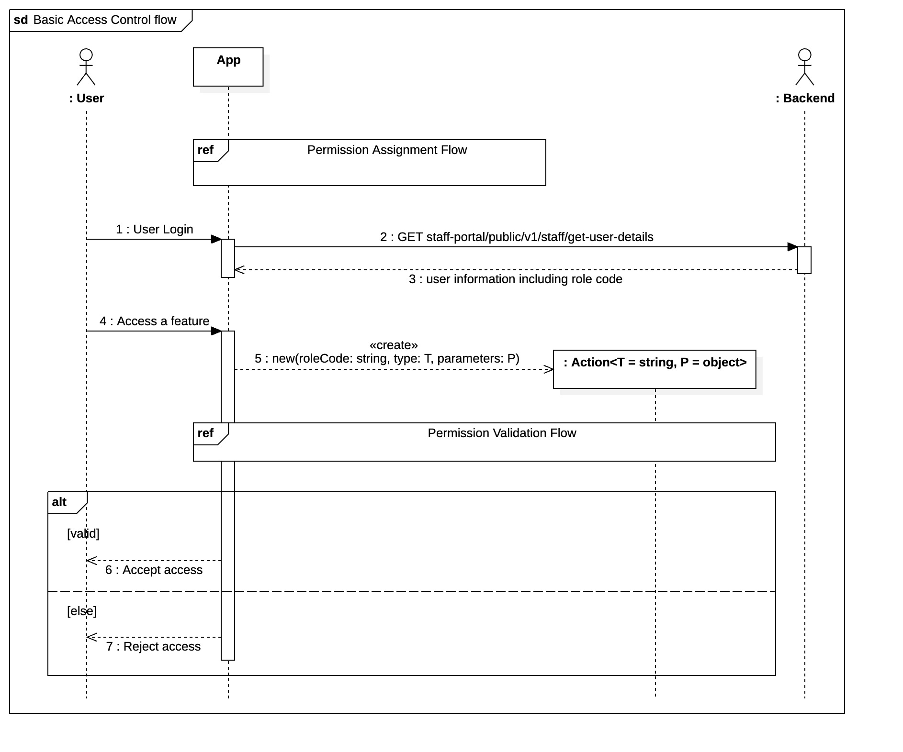
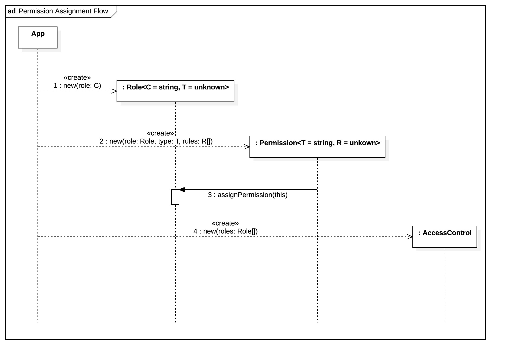
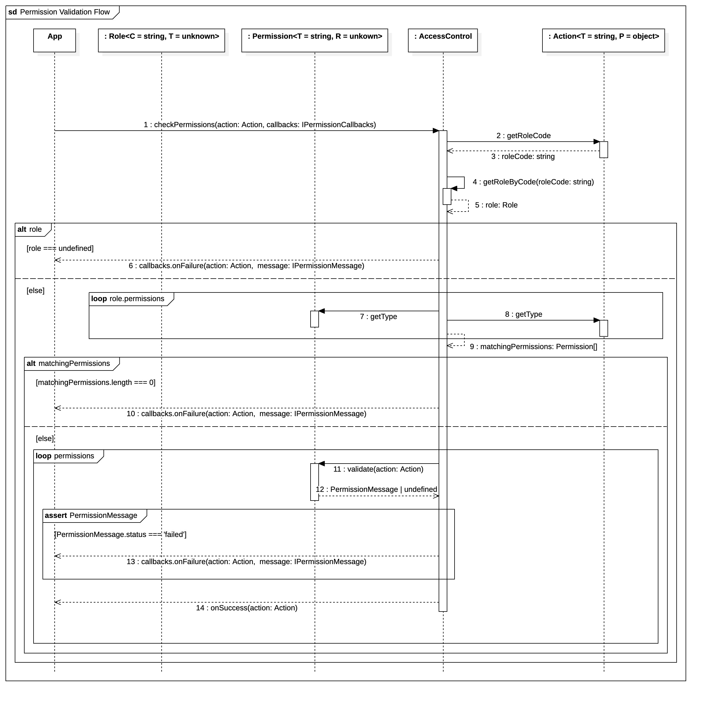

# 🛡️ Access Control Module

> Enterprise-grade access control system with visual UML documentation  
> Featuring role-based permissions, group inheritance, and extensible validation

[](https://opensource.org/licenses/MIT)

[](https://www.typescriptlang.org/)


A robust implementation of role-based access control (RBAC) with:

- **Visual UML documentation** of business logic
- **Hierarchical permissions** with role/group inheritance
- **Extensible validation** for routes, components, dropdowns, and menus
- **Type-safe API** with full TypeScript support

## Features ✨

- **Role & Group Management**
  - Define roles with custom configurations
  - Organize roles into permission groups
  - Hierarchical permission inheritance

- **Permission Types**
  - 🚦 Route access control with regex support
  - 🧩 Component-level permission granularity
  - 📋 Menu visibility management
  - 🔌 Extensible custom permission types

- **Enterprise Features**
  - Middleware support
  - Comprehensive error handling

## Installation 💻

```bash
npm install @ricky-fn/permit-core
```

## Quick Start 🚀

### 1. Import Required Modules

```typescript
import {
	Role,
	Group,
	createAccessControl,
	createRoutePermission,
	RouteAccessAction,
} from "@ricky-fn/permit-core";
```

### 2. Create Roles and Groups

```typescript
// Create roles and groups
const adminRole = new Role("admin");
const group = new Group("content-team");

// Assign roles to group
group.assignRole(adminRole);
```

### 3. Define Permissions

```typescript
// Group Route Permissions
const groupRoutePermission = createRoutePermission(adminRole, [
	{ route: /.*/ },
]);

// Role route permissions, add exclude flag to deny the access.
const adminDropdownPermission = createDropdownPermission(adminRole, [
	{ route: /^admin\/*+/ }, // Allow access to routes starting with 'admin/' and any subpaths
	{ route: /^system\/*+/, exclude: true }, // Deny access to routes starting with 'system/' and any subpaths
]);
```

### 4. Initialize Access Control

```typescript
// Initialize access control
const accessControl = createAccessControl({
	roles: [adminRole],
});
```

### 5. Check Access Permissions

```typescript
// Check admin/ route access - Expected to succeed
const adminRouteAccessAction = new RouteAccessAction(adminRole.getCode(), {
	route: "admin/password",
});
accessControl.checkPermissions(adminRouteAccessAction, {
	onSuccess: () => console.log("✅ Admin route access granted!"),
	onFailure: (action, message) =>
		console.error("❌ Admin route access denied:", message),
});

// Check system/ route access - Expected to fail
const systemRouteAccessAction = new RouteAccessAction(adminRole.getCode(), {
	route: "system/reset",
});
accessControl.checkPermissions(systemRouteAccessAction, {
	onSuccess: () => console.log("✅ System route access granted!"),
	onFailure: (action, message) =>
		console.error("❌ System route access denied:", message),
});
```

## Documentation 📚

### Core Concepts

| Concept        | Description                             |
| -------------- | --------------------------------------- |
| **Role**       | Defines user permissions and privileges |
| **Group**      | Organizes roles with shared permissions |
| **Permission** | Rule set for specific resource access   |
| **Action**     | Request to perform an operation         |
| **Validator**  | Checks if action meets permission rules |

### Permission Types

| Type          | Use Case                        |
| ------------- | ------------------------------- |
| **Route**     | Page navigation control         |
| **Component** | UI element visibility/actions   |
| **Menu**      | Navigation menu item visibility |
| **Dropdown**  | Dropdown options visibility     |

### Route Permissions

```typescript
// Route Permissions
const routePermission = createRoutePermission(adminRole, [
	{ route: /^dashboard\/*+/ }, // Allow access to routes starting with 'dashboard/' and any subpaths
	{ route: /^settings\/*+/, exclude: true }, // Deny access to routes starting with 'settings/' and any subpaths
	{ route: "/profile" }, // Allow access to the exact route '/profile'
]);
```

**Key Features**:

- **Regex Support**: Use regular expressions (e.g., `/^dashboard\/*+/`) to match routes dynamically.
- **Exact Matches**: Use strings (e.g., `'/profile'`) to match routes exactly.
- **Exclude Flag**: Set `exclude: true` to explicitly deny access to specific routes or patterns.

### Component Permissions

```typescript
// Component Permissions
const componentPermission = createComponentPermission(adminRole, [
	{ identifier: "dashboard", actions: ["view", "edit"] }, // Allow 'view' and 'edit' actions on the 'dashboard' component
	{ identifier: /^settings-.*/, actions: ["view", "edit"] }, // Allow 'view' and 'edit' action on components with identifiers starting with 'settings-'
	{ identifier: "settings-password", actions: ["edit"], exclude: true }, // Deny 'edit' action on the 'settings-password' component
]);
```

**Key Features**:

- **Identifier Matching**: Use strings (e.g., `'dashboard'`) for exact component matches or regular expressions (e.g., `/^settings-.*/`) for dynamic matching.
- **Action Control**: Specify allowed actions (e.g., `['view', 'edit']`) for each component.
- **Exclude Flag**: Set `exclude: true` to explicitly deny specific actions on components.

### Menu Permissions

```typescript
// Menu Permissions
const menuPermission = createMenuPermission(adminRole, [
	{ identifier: "main-menu", list: ["dashboard", "settings"] }, // Allow 'dashboard' and 'settings' in the 'main-menu'
	{ identifier: "admin-menu", list: ["users", "logs"], exclude: true }, // Deny 'users' and 'logs' in the 'admin-menu'
]);
```

**Key Features**:

- **Identifier Matching**: Use strings (e.g., `'main-menu'`) or regular expressions (e.g., `/^admin-.*/`) to match menu identifiers dynamically.
- **List Control**: Define allowed or denied items in the menu list (e.g., `['dashboard', 'settings']`).
- **Exclude Flag**: Set `exclude: true` to explicitly deny specific items in the menu.

### Dropdown Permissions

```typescript
// Dropdown Permissions
const dropdownPermission = createDropdownPermission(adminRole, [
	{ identifier: "actions-dropdown", list: ["edit", "delete"] }, // Allow 'edit' and 'delete' in the 'actions-dropdown'
	{ identifier: "admin-dropdown", list: ["reset", "shutdown"], exclude: true }, // Deny 'reset' and 'shutdown' in the 'admin-dropdown'
]);
```

**Key Features**:

- **Identifier Matching**: Use strings (e.g., `'actions-dropdown'`) or regular expressions (e.g., `/^admin-.*/`) to match dropdown identifiers dynamically.
- **List Control**: Define allowed or denied items in the dropdown list (e.g., `['edit', 'delete']`).
- **Exclude Flag**: Set `exclude: true` to explicitly deny specific items in the dropdown.

### How Roles and Groups Work

- **Roles** are the building blocks of the access control system. Each role defines a set of permissions that determine what actions a user can perform.
- **Groups** are collections of roles. By assigning roles to groups, you can manage permissions more efficiently, especially in large systems with many roles.
- **Group Inheritance**: Groups can inherit permissions from other groups. For example, if `Group A` inherits from `Group B`, all roles in `Group A` will also have the permissions of `Group B`. This allows for hierarchical permission structures, where higher-level groups grant broader permissions that are inherited by lower-level groups.

### UML Design Overview

**Basic Access Control Flow**:

**Basic Permission Assignment Flow**:

**Basic Permission Validation Flow**:


## Contributing 🤝

We welcome contributions! Please follow these steps:

1. Fork the repository
2. Create your feature branch (`git checkout -b feat/your-feature`)
3. Commit your changes (`git commit -am 'Add some feature'`)
4. Push to the branch (`git push origin feat/your-feature`)
5. Open a pull request

## Commit Message Guidelines

```text
<type>(<scope>): <subject>

<body>

<footer>
```

Example:

```text
feat(permissions): add custom validator hooks

- Implemented beforeValidate/afterValidate hooks
- Added documentation examples
- Updated test coverage

Resolves: #123
```

## License 📄

This project is licensed under the MIT License - see the [LICENSE](https://opensource.org/licenses/MIT) file for details.

## Changelog 📜

### v1.0.0 (Initial Release)

- Core RBAC implementation
- Role and Group management
- Route, Component, Menu, and Dropdown permissions
- TypeScript support
- UML documentation
